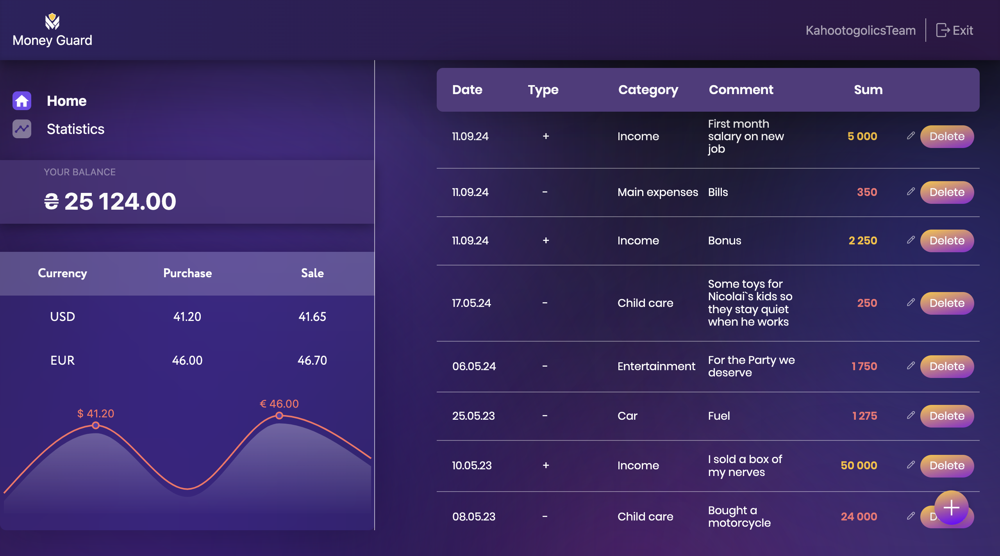

## Money Guard 💰

[](https://money-guard-team-project.vercel.app/)

## 

**Money Guard** is a personal accounting application that helps users manage their income and expenses. With secure authorization, real-time currency exchange rates, and detailed statistics, the app provides a seamless and user-friendly way to track finances across multiple devices.

---

### Features

- **Authorization System:** Secure user registration and login.
- **Home Page**: A general overview of all transactions with detailed summaries.
- **Statistics Page**: Graphical representations of income and expenses for selected months or years.
- **Currency Exchange Rates**: View real-time exchange rates for USD and EUR.
- **Responsive Design**: Fully compatible with desktop, tablet, and mobile devices.

---

### Getting Started

To set up and run the project locally, follow these steps:

1. Clone the repository:

```
git clone https://github.com/anna-vasylenko/Money-Guard-TeamProject.git
cd Money-Guard-TeamProject

```

2. Install project dependencies:

```
npm install
```

3. Start the Development Server:

```
npm run dev
```

---

### Skills and Tools

- **React**: Building dynamic user interfaces.
- **Redux Toolkit**: State management with predictable updates.
- **Redux-Persist**: Preserving state across sessions.
- **JavaScript (ES6+)**: Advanced JavaScript for dynamic functions.
- **Axios**: API interaction and HTTP requests.
- **Formik + Yup**: Form handling and validation.
- **Chart.js & Recharts**: Interactive chart creation.
- **CSS Modules**: Localized component styling.
- **Vite**: Fast bundling and hot-reloading.
- **Vercel**: Seamless deployment and hosting.

---

### Project Contributors

- [Anna Vasylenko][1] - Team Lead & Developer
- [Vadym Lantukh][2] - Developer
- [Nicolai Dodeac][3] - Developer
- [Vitalii Intelegator][4] - Scrum Master & Developer
- [Olha Mykhalchuk][5] - Developer
- [Julia Paramonova][6]- Developer
- [Yaroslav Mudrevskyi][7] - Developer
- [Vlad Kuznetcov][8] - Developer

[1]: https://github.com/anna-vasylenko "Anna Vasylenko"
[2]: https://github.com/VadymLantukh "Vadym Lantukh"
[3]: https://github.com/NicolaiDodeac "Nicolai Dodeac"
[4]: https://github.com/Dekizber "Vitalii Intelegator"
[5]: https://github.com/OlhaMy "Olha Mykhalchuk"
[6]: https://github.com/juliaparamonova "Julia Paramonova"
[7]: https://github.com/yaroslav-mudrevskyi "Yaroslav Mudrevskyi"
[8]: https://github.com/Vlad-Kuznetcov "Vlad Kuznetcov"

---
